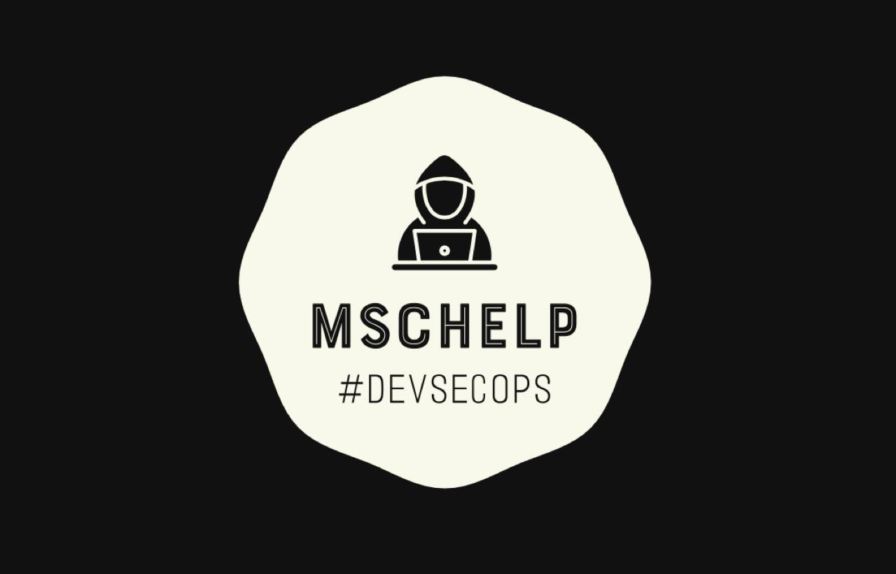

# Marcelo Camargo

## Perfil Profissional

Olá! Sou Marcelo Camargo, um profissional de TI altamente qualificado, especializado em DevSecOps e apaixonado por encontrar soluções inovadoras para desafios de segurança. Minha experiência abrange uma ampla gama de áreas, incluindo infraestrutura, redes, desenvolvimento e análise de dados, combinada com um forte conhecimento em cibersegurança.

### Principais Habilidades

- **Linguagens de Programação:** Python, PHP, JavaScript, HTML e CSS
- **Frameworks e Tecnologias:** Flask e Kivy
- **Banco de Dados:** SQL, MySQL, PostgreSQL e MariaDB
- **Ferramentas e Plataformas:** Kubernetes, Git, Shell Scripting e Visual Studio Code

### Resumo

Sou um profissional em constante aprendizado, sempre buscando aprimorar minhas habilidades e acompanhar as tendências do setor. Meu foco principal está em garantir a proteção dos dados e sistemas críticos da organização, utilizando práticas e ferramentas de DevSecOps para integrar a segurança desde o início do ciclo de vida do desenvolvimento. Além disso, estou familiarizado com o uso do Visual Studio Code como minha principal ferramenta de desenvolvimento.

---

**Links Úteis:**

---

**MSCHelp**

Este repositório é para estudo e aprendizado.
